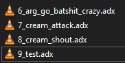

!!! info

    AFS is a general purpose data container from CRI Middleware.  
    Code for this emulator lives inside main project's GitHub repository.  

## Supported Applications

This emulator should support every application out there.  

It has been tested with the following:  
- Sonic Heroes (PC)  
- Silent Hill 3 (PC)  
- Sonic Adventure 2 (PC)  
- Shadow The Hedgehog (Japanese, GameCube, Dolphin Emulator, Running from FileSystem)  

## Example Usage

A. Add a dependency on this mod in your mod configuration. (via `Edit Mod` menu dependencies section, or in `ModConfig.json` directly)

```json
"ModDependencies": ["reloaded.universal.fileemulationframework.afs"]
```

B. Add a folder called `FEmulator/AFS` in your mod folder.  
C. Make folders corresponding to AFS Archive names, e.g. `SH_VOICE_E.AFS`.  

Files inside AFS Archives are accessed by index, i.e. order in the archive: 0, 1, 2, 3 etc.  

Inside each folder make files, with names corresponding to the file's index.  

### Example(s)

To replace a file in an archive named `EVENT_ADX_E.AFS`...

Adding `FEmulator/AFS/EVENT_ADX_E.AFS/0.adx` to your mod would replace the 0th item in the original AFS Archive.

Adding `FEmulator/AFS/EVENT_ADX_E.AFS/32.aix` to your mod would replace the 32th item in the original AFS Archive.



File names can contain other text, but must start with a number corresponding to the index.

!!! info 

    For audio playback, you can usually place ADX/AHX/AIX files interchangeably. e.g. You can place a `32.adx` file even if the original AFS archive has an AIX/AHX file inside in that slot. 

!!! info 

    A common misconception is that AFS archives can only be used to store audio. This is in fact wrong. AFS archives can store any kind of data, it's just that using AFS for audio was very popular.

!!! info 

    If dealing with AFS audio; you might need to make sure your new files have the same channel count as the originals.


## Programmatic Usage

Add a project or package reference to the
[`AFS.Stream.Emulator.Interfaces`](https://www.nuget.org/packages/AFS.Stream.Emulator.Interfaces)
NuGet package, then [obtain the `IAfsEmulator` controller through Reloaded-II](https://reloaded-project.github.io/Reloaded-II/DependencyInjection_Consumer/).

`AddFile(file, route, index)` registers a source file for indexes 0 through 65535 in AFS paths matching `route`.

`AddDirectory(dir)` treats `dir` like the root of a mod's `FEmulator/AFS` folder, so its
archive directories and index-named files use the same routing rules as folder loading.

```csharp
using AFS.Stream.Emulator.Interfaces;

if (_modLoader.GetController<IAfsEmulator>().TryGetTarget(out var afsEmulator))
    // Replace file at index 0 in event_adx_e.afs
    afsEmulator.AddFile(sourcePath, "data/sound/event_adx_e.afs", 0);
else
    _logger.WriteLine("The AFS emulator controller is unavailable.");
```

Register inputs when your mod boots up, before the target AFS is first opened. Emulated archives are cached for
the application lifetime, so later registrations do not rebuild an existing stream.