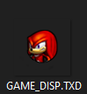
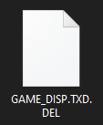

!!! info

    .ONE is a general purpose data container developed (presumably) at some branch of Sonic Team.  This emulator is for the Sonic Heroes variant. Code for thie emulator lives inside the main project's GitHub repository.  

## Supported Applications

- Sonic Heroes (PC)  
- Sonic Heroes XBOX (Emu)  

and any tools that operate on the format...  

## Example Usage 

A. Add a dependency on this mod in your mod configuration. (via `Edit Mod` menu dependencies section, or in `ModConfig.json` directly)

```json
"ModDependencies": ["reloaded.universal.fileemulationframework.heroes.one"]
```

B. Add a folder called `FEmulator/ONE` in your mod folder.  
C. Make folders corresponding to ONE Archive names, e.g. `game_disp.one`.  

Put files inside that folder to perform various actions.  

!!! info

    Refer to [Routing](../routing.md) if you want to use more specific file names.

## Adding/Replacing Files

!!! warning

    Uncompressed files will suffer from a small load time penalty upon first load of the file, since they will need to be compressed as the ONE format does not support uncompressed files.  

Simply place the file in your `.one` directory.  



(game_disp.one/GAME_DISP.TXD)

Files placed in the directory will replace the files stored inside the ONE archive.  

!!! tip

    You should [pre-compress your files using this tool](https://github.com/Sewer56/dlang-prs/releases/latest) to avoid load time penalties. Recommend buffer size of 8191.  

    Add `.PRS` extension to compressed files. e.g. `GAME_DISP.TXD.PRS`.  

!!! danger

    Seriously, please compress your files.  Uncompressed files are backed by pagefile, overuse of those may lead to performance problems.

!!! note

    Pre-compressing files prevents them from working with other emulators. If there would hypothetically be, a TXD emulator some day; and you want to merge some textures in; don't pre-compress your TXD.  

## Deleting Files

In order to delete a file, create an empty file with the name of the file and extension `.del`.



e.g. This would remove the file `GAME_DISP.TXD` from the original archive.  

!!! note

    The archive builder works in the order `Delete` then `Add`. If a file is first deleted, it can be re-added by either the same or another mod.

## Programmatic Registration

Add a project or package reference to the
[`ONE.Heroes.Stream.Emulator.Interfaces`](https://www.nuget.org/packages/ONE.Heroes.Stream.Emulator.Interfaces)
NuGet package, then [obtain the `IOneEmulator` controller through Reloaded-II](https://reloaded-project.github.io/Reloaded-II/DependencyInjection_Consumer/).

Call `AddFile(file, route)` to register a source for matching ONE archives, or `AddDirectory(dir)`
to use the same redirector-style layout described above.

```csharp
using ONE.Heroes.Stream.Emulator.Interfaces;

if (_modLoader.GetController<IOneEmulator>().TryGetTarget(out var oneEmulator))
    // Replace the entry named after sourcePath's file name in game_disp.one
    oneEmulator.AddFile(sourcePath, "dvdroot/stage/game_disp.one");
else
    _logger.WriteLine("The ONE emulator controller is unavailable.");
```

Register inputs when your mod boots up, before the target archive is first emulated; an already cached archive is not rebuilt.

Programmatic inputs follow the same replacement, compression, and deletion rules as folder inputs; see
[Adding/Replacing Files](#addingreplacing-files) and [Deleting Files](#deleting-files). As with folder inputs,
uncompressed sources are PRS-compressed lazily at first archive request.
